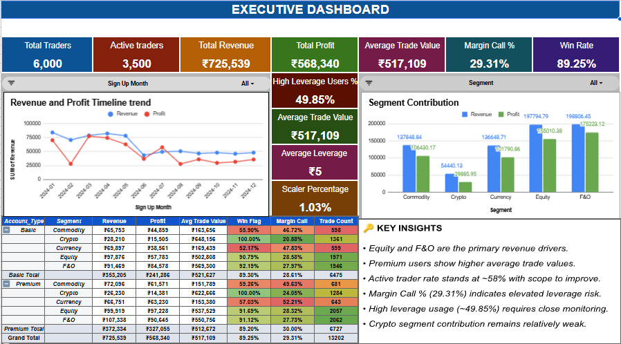
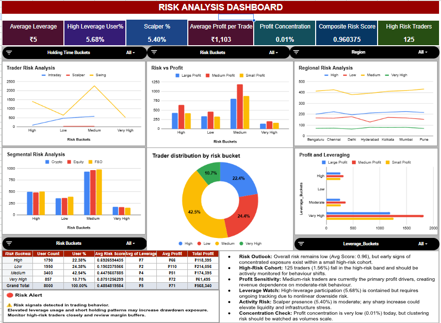
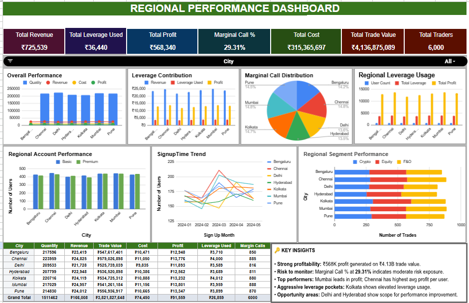

# 📊 Trading Analytics Suite (Google Sheets)

##  Project Overview

A comprehensive multi-dashboard trading analytics solution built in Google Sheets to analyze platform performance, user behavior, revenue trends, and leverage-driven risk exposure.

The project consists of three interactive dashboards:

- 📈 Executive Dashboard
- ⚠️ Risk Analysis Dashboard
- 🌍 Regional Performance Dashboard

Designed to simulate real-world fintech reporting for leadership and risk teams.

---

# 🎯 Business Objectives

- Monitor revenue and profitability trends
- Track active trader engagement
- Identify high-risk trading behavior
- Evaluate segment-level performance
- Analyze regional contribution and exposure
- Enable leadership-level decision making

—
## Dashboard Preview:

## Live Dashboard:
 [View Interactive Dashboard](Fintech)

# 🖥️ Dashboard 1: Executive Dashboard

### Purpose:
High-level business performance monitoring.

###  KPIs:
- Total Traders
- Active Traders
- Total Revenue
- Total Profit
- Average Trade Value
- Win Rate
- Margin Call %
- High Leverage Users %
- Scalper %
- Average Trade Value
- Average leverage

### Includes:
- Revenue & Profit monthly trend
- Segment contribution analysis
- Executive master pivot (Account Type × Segment)
- Dynamic slicers for filtering

---

# ⚠️ Dashboard 2: Risk Analysis Dashboard

### Purpose:
Monitor platform-level trading risk exposure.

### KPIs:
- High Leverage User %
- Profit Concentration
- Average Leverage
- Scalper %
- Composite Risk score
- Average Profit per trade
- High Risk Traders

### Insights Generated:
- Identification of leverage-heavy segments
- Margin stress clusters
- Risk behavior patterns across user types

---

# 🌍 Dashboard 3: Regional Performance Dashboard

### Purpose:
Geographic contribution and performance analysis.

### Metrics:
- Total Revenue
- Total Leverage Used
- Total Profit
- Marginal Call %
- Total Cost
- Total Trade Value
- Total Traders

### Business Value:
- Identify high-performing regions
- Detect risk-heavy cities
- Support expansion decisions

---

# 📊 Technical Implementation

### Tools Used:
- Google Sheets
- Pivot Tables
- Calculated Fields
- Helper Columns (Binary Risk Flags)
- Conditional Formatting (Heatmaps & Risk Signals)
- Slicers
- KPI Cards
- Interactive Charts

---

# 🧠 Data Model Includes

- User_ID
- Account_Type (Basic / Premium)
- Segment (Commodity, Crypto, Currency, Equity, F&O)
- City
- Trade_ID
- Trade_Value
- Revenue
- Profit
- Leverage_Used
- Holding_Time_Hours
- Margin_Call_Flag

---

# 🔑 KEY INSIGHTS
- Strong profitability: ₹568K profit generated on ₹4.13B trade value.
- Risk to monitor: Marginal Call % at 29.31% indicates moderate risk exposure.
- Top performers: Mumbai leads in profit; Chennai has highest avg profit per user.
- Aggressive leverage pockets: Kolkata shows elevated leverage usage.
- Opportunity areas: Delhi and Hyderabad show scope for performance improvement.
- Equity and F&O are the primary revenue drivers.
- Premium users show higher average trade values.
- Active trader rate stands at ~58% with scope to improve.
- Margin Call % (29.31%) indicates elevated leverage risk.
- High leverage usage (~49.85%) requires close monitoring.
- Crypto segment contribution remains relatively weak.
- Risk Outlook: Overall risk remains low (Avg Score: 0.96), but early signs of concentrated exposure exist within a small high-risk cohort.
- High-Risk Cohort: 125 traders (1.56%) fall in the high-risk band and should be actively monitored for behaviour shifts.
- Profit Sensitivity: Medium-risk traders are currently the primary profit drivers, creating revenue dependence on moderate-risk behaviour.
- Leverage Watch: High-leverage participation (5.68%) is contained but requires ongoing tracking due to nonlinear downside risk.
- Activity Risk: Scalper presence (5.40%) is moderate; any sharp increase could elevate liquidity and infrastructure stress.
- Concentration Check: Profit concentration is very low (0.01%) today, but clustering risk should be watched as volumes scale.

---

# 🏆 Skills Demonstrated

- Business Intelligence & KPI Design
- Financial & Risk Analytics
- Executive Reporting
- Multi-dimensional Pivot Engineering
- Data Storytelling
- Dashboard UX Design
- FinTech Domain Understanding

---

## 👤 Author

Kavyananda K
Data Analyst | Business Intelligence | FinTech Analytics

---

⭐ If you found this project insightful, feel free to star the repository!
